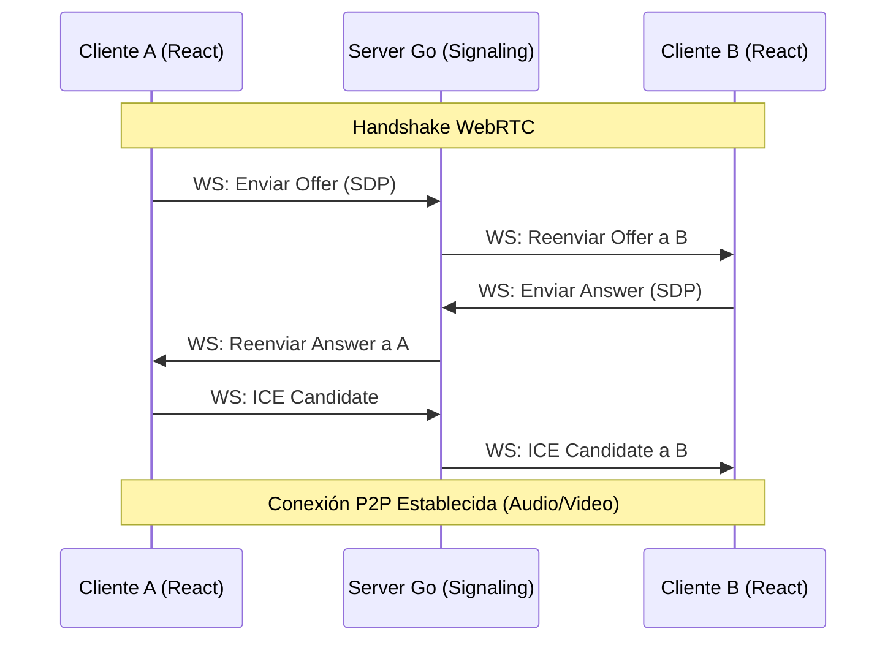
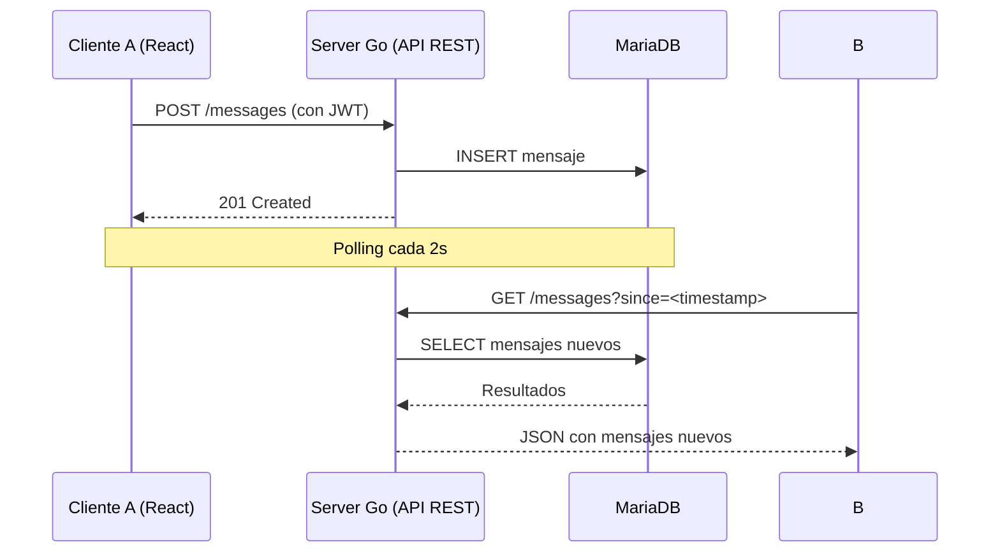

# DaveChat — Arquitectura y Documentación Técnica

## 1. Introducción
**DaveChat** es una plataforma de comunicación en tiempo real inspirada en WhatsApp Web, diseñada para ofrecer mensajería instantánea y videollamadas de alta calidad. Este documento define la arquitectura, el esquema de datos y el protocolo de comunicación para asegurar una implementación escalable y robusta.

---

## 2. Arquitectura del Sistema

El sistema utiliza un enfoque híbrido para la comunicación:
- **Backend:** Servidor Go (API REST + WebSocket signaling).
- **Base de Datos:** MariaDB 11 en Dokploy para persistencia (`192.168.101.133:3307`).
- **Autenticación:** bcrypt + JWT (custom, sin dependencias externas).
- **Mensajería:** Polling HTTP cada 2s para consultar nuevos mensajes.
- **Señalización WebRTC:** Servidor Go vía WebSockets (gorilla/websocket) para intercambio de metadatos de medios.
- **Transmisión de Medios:** P2P mediante **WebRTC** (con soporte de Coturn para entornos restringidos).

### Diagrama de Flujo — Señalización WebRTC


### Diagrama de Flujo — Mensajería


---

## 3. Estructura del Proyecto (Monorepo)
```
DaveChat/
├── client/              # Frontend React + Vite + Tailwind
│   ├── src/
│   │   ├── components/  # AuthLayout, ChatWindow, MainLayout, VideoOverlay
│   │   ├── hooks/       # useAuth
│   │   └── lib/         # api.js (cliente HTTP + JWT)
├── server/              # Backend Go (API + Signaling)
│   ├── cmd/             # main.go
│   ├── internal/
│   │   ├── config/      # Config loader
│   │   ├── database/    # Conexión MariaDB
│   │   ├── handlers/    # Auth, Profile, Conversation, Message handlers
│   │   ├── middleware/   # JWT auth middleware
│   │   ├── signaling/   # (para futura expansión)
│   │   └── websocket/   # Hub + WebSocket handler
├── infra/               # Infraestructura
│   ├── mariadb/         # init.sql
│   └── docker-compose.yml
```

---

## 4. Esquema de Base de Datos (MariaDB)

### Tabla: `profiles`
| Columna | Tipo | Descripción |
|---------|------|-------------|
| `id` | CHAR(36) PK | UUID v4 del usuario |
| `username` | VARCHAR(50) UNIQUE | Nombre de usuario único |
| `email` | VARCHAR(255) UNIQUE | Email único (usado para login) |
| `password_hash` | VARCHAR(255) | Hash bcrypt de la contraseña |
| `avatar_url` | TEXT | URL del avatar |
| `status` | ENUM('online','offline','away') | Estado de presencia |
| `last_seen` | DATETIME(3) | Última actividad |
| `created_at` | DATETIME(3) | Fecha de registro |
| `updated_at` | DATETIME(3) | Última actualización |

### Tabla: `conversations`
| Columna | Tipo | Descripción |
|---------|------|-------------|
| `id` | CHAR(36) PK | UUID v4 |
| `type` | ENUM('direct','group') | Tipo de conversación |
| `created_at` | DATETIME(3) | Fecha de creación |
| `last_message_at` | DATETIME(3) | Fecha del último mensaje |

### Tabla: `participants`
| Columna | Tipo | Descripción |
|---------|------|-------------|
| `conversation_id` | CHAR(36) FK | Referencia a conversations |
| `user_id` | CHAR(36) FK | Referencia a profiles |
| `joined_at` | DATETIME(3) | Fecha de ingreso |
| PK | (conversation_id, user_id) | |

### Tabla: `messages`
| Columna | Tipo | Descripción |
|---------|------|-------------|
| `id` | CHAR(36) PK | UUID v4 |
| `conversation_id` | CHAR(36) FK | Referencia a conversations |
| `sender_id` | CHAR(36) FK | Referencia a profiles |
| `content` | TEXT | Contenido del mensaje |
| `type` | ENUM('text','call') | Tipo de mensaje |
| `created_at` | DATETIME(3) | Fecha de envío |

---

## 5. Protocolo de Señalización (Go WebSockets)

El servidor en Go actuará como un "relay" de mensajes de señalización. Los eventos clave son:

1. **`signal:offer`**: Enviado por quien inicia la llamada con el SDP (Session Description Protocol).
2. **`signal:answer`**: Enviado por el receptor para aceptar la oferta.
3. **`signal:ice-candidate`**: Intercambio de rutas de red (ICE) para atravesar NATs.
4. **`call:reject`**: Si el usuario declina la llamada.
5. **`call:busy`**: Si el usuario ya está en otra sesión.

---

## 6. Plan de Implementación

### Fase 1: Cimientos (Go Server + MariaDB + Auth)
- Configurar servidor Go con router (Chi/Gin), middlewares, handlers.
- Base de datos MariaDB en Dokploy (ver `dokploy.md`).
- Implementar registro y login con bcrypt + JWT.
- Crear UI base en React (AuthLayout, ChatWindow, MainLayout).

### Fase 2: Mensajería (API REST + Polling)
- Implementar handlers CRUD para conversaciones y mensajes en Go.
- Integración de polling HTTP desde el cliente (cada 2s).
- Sincronización de estados (online/offline/away) vía API.

### Fase 3: Señalización WebRTC (Go WebSocket)
- Desarrollar el servidor WebSocket en Go usando gorilla/websocket.
- Implementar lógica de "Rooms" o "User Mapping" para dirigir mensajes de señalización.
- Desplegar servidor Coturn usando Docker para soporte de TURN (necesario en redes 4G/Corporativas).

### Fase 4: Multimedia (WebRTC Integration)
- Integrar `RTCPeerConnection` en el cliente React.
- Manejar flujos de audio/video local y remoto.
- Implementar lógica de reconexión y estados de llamada (Ring, Connected, Ended).

### Fase 5: Limpieza
- Eliminar dependencias y artefactos de Supabase.
- Actualizar documentación (DB.md, RESUMEN.md).
